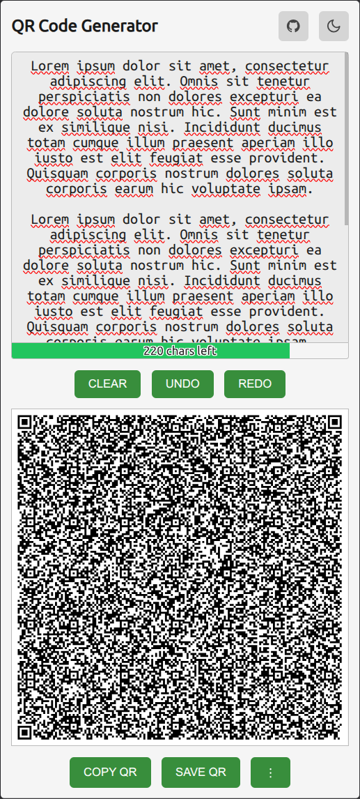
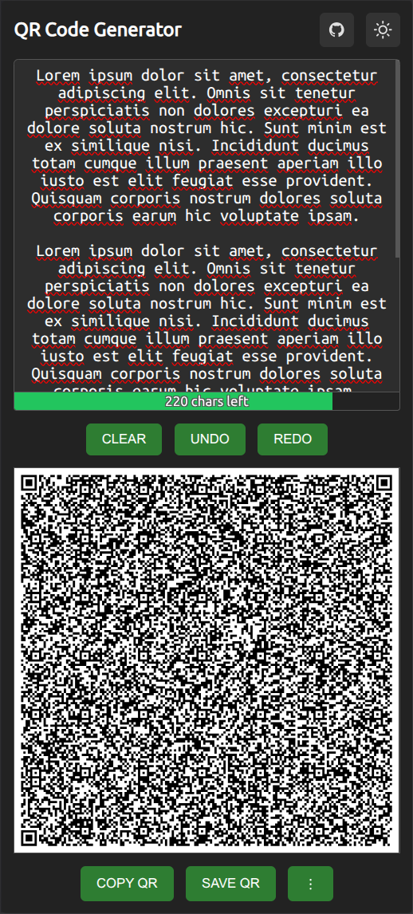

# QR Code Offline Generator

 

An offline QR code generator that runs locally in your browser and can be installed on your mobile device.

Open [QR Code Offline Generator](https://danieldreke.github.io/qr-code-generator/)

Pure Markdown can't set image widths. Use HTML instead:

 

## Features

- Generate QR codes from any text or URL
- Works fully offline after first load
- Installable as a PWA on mobile and desktop
- Save QR code as PNG or SVG
- Copy QR code as PNG or SVG
- Dark / light theme toggle
